Aquí está la estrategia completa estructurada por fases, pensada específicamente para el contexto del Mundial 2026 y el stack Python + W&B.

---

## Estrategia del proyecto: modelo predictivo de partidos de fútbol

El proyecto se divide en 5 fases secuenciales, pero con ciclos de feedback entre el modelado y la definición del problema.

---

### Fase 1 — Definición del problema

Antes de tocar un dato, hay que anclar bien qué se va a predecir y cómo se va a medir el éxito.

**Targets a definir:**
- Resultado 3-way (W/D/L): el más común, clasificación multiclase
- Probabilidades de goles por equipo: regresión / Poisson
- Ambos a la vez (multitask): más complejo pero más rico

**Métricas de éxito:**
- Accuracy y log-loss para el target 3-way (log-loss es la métrica canónica porque penaliza la mala calibración)
- Brier Score para evaluar calibración de probabilidades
- Comparar contra baselines ingenuos: siempre predecir que gana el mejor rankeado por Elo, o siempre empate

**Scope inicial para el Mundial 2026:**
- Fase de grupos: 48 equipos, 6 partidos por grupo → 72 partidos
- Rondas eliminatorias: 32 partidos hasta la final
- El modelo debe manejar ausencia de historial reciente para selecciones que clasifican rara vez

---

### Fase 2 — Recopilación y construcción de datos

**Fuentes gratuitas a integrar:**

| Fuente | Datos | Librería / método |
|---|---|---|
| football-data.org API | Resultados históricos de selecciones, fixture | `requests` + parsing manual |
| FIFA / UEFA rankings | Rankings oficiales por fecha | Scraping o CSV público |
| Transfermarkt | Valor de mercado del plantel, edad promedio | `BeautifulSoup` / `pandas` |
| SofaScore / Fotmob | xG por partido (más reciente) | Scraping |
| World Football ELO | Ratings Elo históricos | Descarga directa CSV |
| RSSSF | Resultados históricos Copa del Mundo desde 1930 | CSV descargable |

**Features a construir por partido:**
- Rating Elo de ambos equipos y diferencial
- FIFA ranking y diferencial
- Forma reciente: últimos N partidos (promedio de goles, victorias, con decay exponencial)
- Head-to-head histórico (win rate, gol average)
- xG promedio de los últimos 10 partidos
- Valor de mercado agregado del plantel
- Días de descanso / tiempo desde último partido
- Condición: local, visitante, neutral (todos los partidos mundialistas son en sede neutra)
- Confederación de origen (codificación)
- Fase del torneo (puede usarse si se entrena con datos de torneos previos)

**Pipeline de datos:**
`ingesta raw → limpieza → merge → feature engineering → feature store (parquet/CSV versionado)`

---

### Fase 3 — Experiment tracking con Weights & Biases

Esta es la columna vertebral del proyecto. Cada experimento que se corra — desde un baseline hasta el modelo final — queda registrado.

**Configuración del workspace W&B:**
- Un proyecto por scope: `wc2026-predictions`
- Artifacts para versionar: datasets, feature sets, modelos entrenados
- Sweeps para hyperparameter tuning automatizado
- Reports para documentar decisiones

**Lo que se loguea en cada run:**
- Hiperparámetros del modelo
- Métricas por fold (cross-validation temporal)
- Feature importances
- Curvas de calibración
- Confusion matrix del target 3-way
- Distribución del Brier Score

**Convención de naming de runs:**
`{modelo}_{feature_set}_{cv_strategy}_{fecha}`, por ejemplo: `xgb_v2_temporal_cv_2026-05`

---

### Fase 4 — Modelado y entrenamiento

**Estrategia de validación — este punto es crítico:**

No se puede usar K-Fold aleatorio porque los datos son temporales — modelos entrenados con datos del futuro que predicen el pasado inflan artificialmente las métricas. La estrategia correcta es **time-series split**: entrenar con partidos hasta año N, validar con año N+1, iterando hacia adelante.

**Roadmap de modelos por etapas:**

Etapa 1 — Baselines (semana 1):
- Siempre predecir el favorito por Elo → baseline mínimo a superar
- Regresión logística con features básicos → benchmark interpretable

Etapa 2 — Modelos clásicos (semana 2):
- Random Forest con todas las features → mide importancia
- XGBoost / LightGBM → candidato principal para producción
- Gradient Boosting calibrado con Platt scaling o isotónica

Etapa 3 — Modelos estadísticos especializados (semana 2-3):
- Poisson bivariado para predicción de goles exactos
- Dixon-Coles como variante corregida de Poisson
- Estos se combinan con el modelo ML en un ensemble

Etapa 4 — Ensemble final (semana 3):
- Stacking: los outputs de XGB + Poisson como features de un meta-modelo logístico
- O simplemente promedio ponderado de probabilidades (más robusto con pocos datos)

**Stack Python por capa:**

| Capa | Librerías |
|---|---|
| Manipulación de datos | `pandas`, `numpy` |
| Visualización EDA | `matplotlib`, `seaborn`, `plotly` |
| ML clásico | `scikit-learn` (pipelines, cv, calibración) |
| Gradient boosting | `xgboost`, `lightgbm` |
| Estadístico | `scipy`, `statsmodels` |
| Experiment tracking | `wandb` |
| Hiperparámetros | `wandb sweeps` (internamente usa `optuna` o `bayes`) |
| Serialización | `joblib`, `pickle` |

---

### Fase 5 — Despliegue e integración con el sitio

El modelo entrenado se despliega como un servicio ligero que alimenta footballofnations.com con predicciones actualizadas.

**Arquitectura del despliegue:**

`modelo serializado (joblib) → API REST (FastAPI) → endpoint /predict → frontend Next.js`

Las predicciones se pueden pre-computar para todos los partidos del fixture y almacenarlas en Postgres, de modo que el frontend solo hace lecturas — no hay latencia de inferencia en tiempo real.

**Ciclo de reentrenamiento:**
- Reentrenar después de cada jornada de grupo con los resultados frescos
- Versionar el modelo nuevo en W&B Artifacts
- Comparar métricas del modelo nuevo vs el modelo en producción antes de hacer swap
- Si las métricas degradan → rollback automático al artefacto anterior

**Monitoreo post-despliegue:**
- Loguear predicciones vs resultados reales en W&B como nueva tabla de evaluación
- Alertas si el log-loss real supera 1.5x el log-loss de validación (señal de distribution shift)

---

Ahora el diagrama del flujo completo:---

### Consideraciones transversales para el deadline del 11 de junio

Con menos de 3 semanas, la priorización es clave. El orden de ejecución recomendado:

Semana 1 — datos y baseline: configurar W&B, ingestar datos históricos de selecciones, construir features de Elo + forma reciente, correr regresión logística como primer experimento logueado.

Semana 2 — modelos principales: XGBoost/LightGBM con sweeps de hiperparámetros en W&B, Poisson bivariado, calibración de probabilidades, validación temporal.

Semana 3 (días previos al 11 de junio) — ensemble y despliegue: combinar los mejores modelos, pre-computar predicciones para la fase de grupos completa, cargar en Postgres, exponer vía API.

Lo más importante es **no saltarse la validación temporal** aunque sea tentador por tiempo — un modelo que overfitta a datos futuros puede verse muy bien en notebook pero fallar visiblemente durante el torneo, lo cual es exactamente lo contrario a lo que quieres mostrar en el sitio.

¿Arrancamos con la fase de datos concreta — las fuentes, el schema de la tabla de partidos y las primeras features?