Aquí tienes un panorama completo de los modelos de ML más utilizados en la predicción de resultados deportivos en deportes colectivos:

---

Los modelos se dividen en categorías según el problema que resuelven: predecir resultados (win/draw/loss), puntajes exactos, spreads, totales, o probabilidades para mercados de apuestas/fantasy sports.

**Modelos clásicos / estadísticos**

El modelo de Poisson es históricamente el más usado en soccer y baseball. Modela los goles/carreras de cada equipo como distribuciones de Poisson independientes, con parámetros ajustados por fuerza de ataque y defensa de cada equipo. Una extensión común es el Dixon-Coles (1997), que corrige la dependencia entre resultados bajos (0-0, 1-0, 0-1) que Poisson subestima.

La regresión logística y logística ordinal siguen siendo baseline competitivos para clasificar W/D/L, especialmente cuando las features están bien engineered (Elo ratings, racha, diferencial goles recientes).

**Modelos de árbol / ensemble**

Random Forest y Gradient Boosting (XGBoost, LightGBM, CatBoost) son los caballos de trabajo actuales en la mayoría de competencias académicas y en producción. Manejan bien features heterogéneas (estadísticas de jugadores, clima, fatiga, historial head-to-head), no requieren normalización, y capturan interacciones no lineales. En la NBA y NFL tienden a dominar los leaderboards de predicción porque hay abundancia de datos por juego (tracking, play-by-play).

**Redes neuronales**

Las arquitecturas más aplicadas son:
- **MLP / feedforward** sobre features tabulares agregadas — útil cuando el volumen de partidos históricos es suficiente.
- **LSTM / GRU** para modelar secuencias temporales de rendimiento (rachas, forma reciente, historial de lesiones). El orden importa en deportes donde el momentum es factor real.
- **Graph Neural Networks (GNN)**: crecientes en investigación, modelan las interacciones entre jugadores en cancha como un grafo dinámico. Especialmente explorados en soccer (UEFA, StatsBomb data) y basketball donde la geometría espacial es clave.
- **Transformer-based models**: más recientes, usados sobre series de tiempo de rendimiento por partido o sobre secuencias de jugadas (event data).

**Modelos de rating / ranking**

Elo y sus variantes (Glicko-2, TrueSkill) son frecuentemente usados como features de entrada para otros modelos, más que como predictores directos. FiveThirtyEight usa Elo extendido con SRS (Simple Rating System) para la NFL y NBA. En soccer, clubes como FC Barcelona Research han combinado Elo con Poisson.

**Modelos bayesianos**

Los Bayesian hierarchical models son populares en academia para estimar incertidumbre real. Permiten "shrinkage" hacia promedios cuando hay pocos datos (equipos recién ascendidos, temporadas cortas). Implementados típicamente con Stan o PyMC. El modelo de Dixon-Coles tiene variantes bayesianas ampliamente citadas.

**Por deporte**

| Deporte | Enfoques dominantes |
|---|---|
| Soccer | Poisson bivariado, Dixon-Coles, XGBoost con features de pressing/xG |
| Baseball | Sabermetrics + regresión lineal/logística, survival analysis para innings |
| Basketball (NBA) | Gradient Boosting sobre RAPTOR/BPM, LSTM sobre box scores |
| American Football | Regresión logística con spread/total, Random Forest con situational stats |
| Hockey | Poisson extendido (penales, power-play), XGBoost |

**Consideraciones prácticas clave:**

El problema de calibración es crítico — no alcanza con un modelo preciso, necesitas que las probabilidades outputadas (ej. 65% de ganar) sean realmente calibradas si vas a usarlas para apuestas o fantasy. Platt scaling e isotonic regression son los métodos estándar post-entrenamiento.

**Feature engineering** suele ser más impactante que la elección del modelo. Las features más valiosas incluyen xG (expected goals en soccer), RAPM/BPM (basketball), QBR/EPA (NFL), REST days, home/away, head-to-head histórico, y forma reciente ponderada exponencialmente.

**Ensemble de modelos** es la práctica dominante en producción: combinar un modelo estadístico (Poisson/Dixon-Coles para capturar estructura del juego) con un modelo ML (XGBoost sobre features ricas) y calibrar el output conjunto. FiveThirtyEight, Opta, y StatsBomb usan variantes de este approach.

Para footballofnations.com, si quieres un modelo predictivo del Mundial 2026, el stack más pragmático sería: **Elo FIFA como feature base + XGBoost/LightGBM con features de UEFA/CONMEBOL rankings, goles recientes, y xG agregado** — es implementable, interpretable, y competitivo contra modelos más complejos.